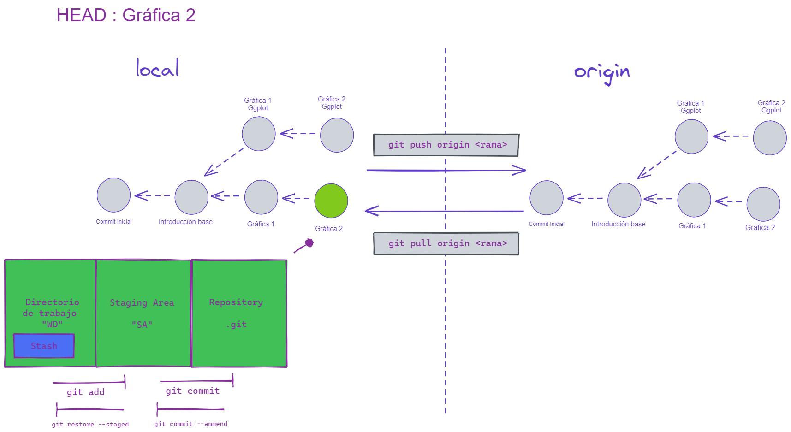

```{r setup, include = F , warning = F }

options(htmltools.dir.version = FALSE)
if(!require(pacman)) {install.packages("pacman")}
pacman::p_load(
  xaringanthemer,
  here,
  RefManageR,
  bibtex,
  htmltools,
  showtext
)


# Configuración del tema Xaringan:

style_duo_accent(
  primary_color = "#03A696",
  secondary_color = "#035AA6",
  header_font_google = google_font("Signika", "600"),
   text_font_google   = google_font("Cantarell", "300", "300i"),
   code_font_google   = google_font("Source Code Pro"),
   base_font_size = "19px",
   text_font_size = "1rem",
   code_font_size = "0.7rem",
   code_inline_font_size = "0.7em",
   footnote_font_size = "0.6em",
   header_h1_font_size = "1.9rem",
   header_h2_font_size = "1.70rem",
   header_h3_font_size = "1.5rem"
)

```
class: header_background

# ¿Qué es y para que sirve git? 

- #### <font color = #000000> Es un sistema de control de versiones diseñado (originalmente) para desarrollo de software de manera colaborativa. <font> 

--

- #### <font color = #000000> Lo usamos para manejar la colección de archivos que hacen a un proyecto (datos, figuras, reportes, código fuente). <font>

--

- #### <font color = #000000> Git permite el seguimiento de la evolución de un conjunto de archivos que se llama repositorio. <font>
--

- #### <font color = #000000> Un sistema de control de versiones nos va a servir para trabajar en equipo de una manera mucho más simple y optima cuando estamos desarrollando software. <font> 
--

- #### <font color = #000000> Trackear y obtener versiones anteriores de nuestro proyecto de manera sencilla <font> 

---

class: header_background

# Comandos básicos en terminal

- #### <font color = #000000> **pwd:** Ver la ruta actual <font>

- #### <font color = #000000> **cd:** Navegar entre carpetas <font>

- #### <font color = #000000> **ls:** Listar los archivos de una carpeta <font>

--

- #### <font color = #000000> **cp,mv:** Nos permite copiar archivos, mover o renombrarlos <font>

- #### <font color = #000000> **cp -r:** Copiar carpetas <font>

- #### <font color = #000000> **mkdir:** Permite crear carpetas <font>

- #### <font color = #000000> **rm:** Eliminar archivos <font>

- #### <font color = #000000> **rmdir:** Eliminar carpetas <font>

--

Y muchos más, zip,unzip,touch,echo,cat,tail,head y un largo etc.
---

class: header_background

# Instalación : 

## <font color = #03A696> En windows : <font>  

<https://git-scm.com/download/win> 

--

## <font color = #03A696> En linux basado en Fedora : <font>  

```{bash, eval = F}
sudo apt-get install git-all
```

--

## <font color = #03A696> En Mac (con el uso de Homebrew) : <font>

```{bash, eval = F}
/bin/bash -c "$(curl -fsSL https://raw.githubusercontent.com/Homebrew/install/HEAD/install.sh)"
brew install git
```
---

class: header_background

# Terminología

- #### <font color = #000000> **Repository:** Archivos, directorios a las cuales git les esta haciendo seguimiento. <font> 

--

- #### <font color = #000000> **Clone:** Copia local de un repositorio en la nube. <font> 

--

- #### <font color = #000000> **Pull:** Traer a nuestro repositorio local los cambios locales de la nube. <font> 

--

- #### <font color = #000000> **Commit:** Confirmación 'instantanea' de nuestro directorio de trabajo, cada uno de ellos tiene un identificador único, hora y el nombre de la persona que lo hizo.<font> 

--

- #### <font color = #000000> **Push:** Enviar nuestras confirmaciones al repositorio remoto. <font> 

--

Y mas, como **pull request**, **fork**, etc.

---


class: header_background

# Repositorio locales y remotos 
.center[
```{r,out.width = 900, fig.retina =2,echo = F}
 
```
]

---

class: header_background

# Guía del taller

- ## <font color = #000000> **Módulo 1:** Introducción a git <font>

--

- ## <font color = #000000> **Módulo 2:** Uso del control de versiones <font>

--

- ## <font color = #000000> **Módulo 3:** Correción de errores <font>

--

- ## <font color = #000000> **Módulo 4:** Trabajando con ramas <font>

--

- ## <font color = #000000> **Módulo 5:** git stash <font>

---
class: title-slide,middle

# Módulo 1: Introducción a git

## 1. Configurar nuestra información <font> 
## 2. Crear repositorios locales <font>
## 3. Asociar repositorio local con un repositorio remoto <font>
## 4. Workflow of git repository´s  (add, commit, push) <font> 
## 5. Clonar repositorios <font> 

---

class: header_background

# Módulo 1: Introducción a git

## Configurar git

### <font color = #035AA6> git config </font>

--

```{bash, eval = F}
git config --global user.email "Nuestro correo"
git config --global user.name "Nuestro apodo"
```

A cada commit se le asocia está información para identificar los cambios realizados por cada integrante del equipo. 

--

#### <font color = #000000 > Tip: Diferentes nombres en cada proyecto </font>

Podemos modificar esa configuración sin afectar la configuración global, para esto simplemente modificamos lo anterior de esta manera :

```{bash, eval = F}
git config user.email "Nuestro correo"
git config user.name "Nuestro apodo"
```

---

class: header_background

# Módulo 1: Introducción a git

## Crear repositorios locales

### <font color = #035AA6> git init </font>

--

Primero tenemos que situarnos en nuestro directorio, movernos con el comando de la terminal `cd` y la ruta de nuestro directorio entre comillas. 

Una vez hecho esto, vamos a pedirle a git que haga el seguimiento de este directorio, lo haremos de la siguiente forma : 

```{bash, eval = F }
git init 
```

Luego nos saldra un mensaje haciendo referencia a que ya estamos haciendo el seguimiento de nuestro directorio con **git**.
---

class: header_background

# Módulo 1: Introducción a git

## Asociar repositorio local con uno remoto

### <font color = #035AA6> git remote </font>

--

En el caso de querer trabajar con ramas remotas (Github, Gitlab, entre otros) debemos de crear la conexión con la nube. Para esto debemos de contar con una cuenta 
y crear un repositorio desde su página web, para asociar la dirección a nuestro repositorio local. 

```{bash, eval = F}
git remote add origin https://github.com/Usuario/NombreRepositorio.git
```


--

#### Tipos de repositorios remotos : 

- <font color = #000000> **Públicos:** Acceso a todo el mundo.<font> 

- <font color = #000000> **Privados:** Para colaborar y ver el repositorio debemos de ser colaboradores. <font>


---

class: header_background

# Módulo 1: Introducción a git

## Añadir archivos / Agregar cambios  

### <font color = #035AA6> git add </font>

--

Una vez guardemos nuestros cambios en el archivo de manera habitual, debemos de indicarle a git que terminamos de modificarlo.

En el caso que el archivo sea nuevo, este comando agregara el archivo al repositorio y en caso que ya le este haciendo seguimiento irá tomando 
las difrencias.

```{bash, eval = F}
git add archivo.txt
```

--

## Quitar cambios

### <font color = #035AA6> git restore </font>

--

```{bash, eval = F}
git restore --staged archivo.txt
```

---

class: header_background

# Módulo 1: Introducción a git

## Hacer confirmaciones (commit's)

### <font color = #035AA6> git commit </font>

--

```{bash, eval = F}
git commit
```

La terminal de git en windows por defecto usa **VIM** (editor de texto en terminal), una vez ejecutado el siguiente comando se nos desplegará una ventana para escribir el mensaje
del commit, siempre git nos hace una sugerencia, podemos escribir la nuestra o incorporar esta última. 

Para hacer modificaciones sobre este texto debemos de apretar la tecla **INSERT** una vez hecho esto, la terminal entrara en modo edición. 
Para salir de este modo debemos de apretar la tecla **ESC**, el signo de **:** y **wq** para guardar el archivo. Tambien existe **NANO** que automaticamente se entra en modo edición, para guardar y salir utilizamos
**CTRL+O** y **CTRL+X**.

--

#### <font color = #000000> Tip: Mensaje corto </font>

Podemos utilizar el flag **-m**, para indicar el mensaje que queremos.

```{bash, eval = F}
git commit -m "Nuestro mensaje"
```

---

class: header_background

# Módulo 1: Introducción a git

## Subir cambios a la nube

### <font color = #035AA6> git push </font>

--

```{bash, eval = F}
git push <remote> <rama>
```

Debemos de indicarle la dirección del repositorio remoto y la rama que queremos subir.

--


#### <font = #000000 > Tip: Actualizar todas las ramas <font>


```{bash,eval = FALSE}
git push --all <remote>
```

--

#### <font = #000000> Solución de errores: Cambios en historial y actualizar historial remoto</font>

En algunas situaciones, se puede llegar a modificar el historial teniendo como consecuencia que para un mismo commit dos identificadores diferentes, es por esto,
que debemos de actualizarlo en el reposiotorio remoto y advertir a nuestros compañeros.

```{bash,eval = FALSE}
git push --force <remote> <rama>
```


---

class: header_background

# Módulo 1: Introducción a git

## Traer cambios de la nube

### <font color = #035AA6> git pull </font>

--

```{bash, eval = F}
git pull <remote> <rama>
```

--

#### <font = #000000> Solución de errores: Cambios en historial remoto </font>

```{bash,eval = F}
git pull --rebase <remote> <rama>
```

--

## Actualizar ramas remotas pero no fusionarlas con las locales

### <font color =#035AA6> git fetch </font>

--

```{bash,eval = FALSE}
git fetch <remote>
```


---
class: inverse,middle


# Parte práctica 1 

### 1. Crear repositorio con un archivo de texto desde la terminal <font>
### 2. Crear un repositorio en github vacio y añadirlo como fuente remota <font>
### 3. Clonar repositorio del Taller <font>
---

class: title-slide,middle


# Módulo 2: git como sistema de control de versiones


## 1. Ver historial
## 2. Navegar en el historial
## 3. Comparar versiones
## 4. Ver el estado del proyecto

---

class: header_background

# Módulo 2: git como sistema de control de versiones

## Ver historial

### <font color = #035AA6> git log </font>

--

Este comando nos permite ver el historial de todo nuestro proyectox

```{bash, eval = F}
git log
```

--

#### <font color = #000000> Tip: Mejorar la visualización </font> 


```{bash, eval = F}
git log --all --decorate --oneline --graph
```
El comando **all** nos permite ver información sobre todas las ramas, incluso las ocultas que refieren a las remotas, **decorate** nos brinda colores en la terminal, **oneline** hace que tengamos una presentación en la terminal agradabale y **graph** nos da una visualización de la ramificación de nuestro proyecto.  

---

class: header_background

# Módulo 2: git como sistema de control de versiones

## Navegar en nuestro historial

### <font color = #035AA6> git checkout </font>

--

```{bash, eval = F}
git checkout <Hash commit>

```

--

**¡OJO!** Cuando se navega en el historial se crea una 'rama' temporal que apunta a ese commit.

--

## Volver a la situación actual

### <font color = #035AA6> git switch </font>

--

```{bash,eval = F}
git switch -
```

Al que tanto la versión temporal como al lugar donde queremos regresar son ramas, podemos usar **git checkout rama** para volver a la situación actual, pero lo veremos mas adelante.


---

class: header_background

# Módulo 2: git como sistema de control de versiones

## Ver modificaciones actuales

### <font color = #035AA6> git diff </font>

--

Con este comando podemos ver las modificaciones que fuimos haciendo sobre los archivos que git le esta haciendo seguimiento. 

```{bash, eval = F}
git diff <archivo> # Si estaomos interesados en comparar el último commit con lo que esta en el WD
git diff --staged <archivo>s # Si estamos interesados en comparar con SA
```

--

 ## Comparar commits

 ### <font color = #035AA6> git diff </font>

--

También podemos ver cambios relativos entre diferentes commits para esto únicamente debemos de indicar los hash de los dos commit: 

```{bash,eval = F}
git diff <hash commit más viejo> <hash commit mas nuevo> --flag's <archivo>
```
 
---

class: header_background

# Módulo 2: git como sistema de control de versiones

## Ver estado del repositorio


### <font color = #035AA6> git status </font>

--


```{bash, eval = F}
git status 
```

Este comando nos indica información relativa a la rama en la que estamos situados, los cambios que estan prontos para hacerles un commit (**SA**)
y los que todavía se encuentran en el directorio de trabajo (**WD**).

--

#### <font color = #000000> Tip: Versión compacta </font>

```{bash, eval = F}
git status -s
```

A cada archivo se le agrega la información de su estado, por ejemplo:

- **M** a la izquierda (verde) : Archivo modificado y agregado a SA.
- **M** a la derecha (rojo) : Archivo modificado en WD.
- **A** a la izquierda (verde) Nuevo archivo agregado al SA.
- **??** a la derecha (rojo) Archivo nuevo que git nunca le hizo seguimiento.


---

class: inverse,middle


# Parte práctica 2 

### 1. Ver el historial del repositorio del taller <font>
### 2. Agregar un cambio a nuestro repositorio de prueba y ver git diff <font>
### 3. Salida del git status (en sus dos versiones) <font>


---

class: title-slide,middle


# Módulo 3: Correción de errores en el proyecto


## 1. Modificar confirmaciones  <font> 
## 2. Volver a versiones anteriores sin dejar una confirmación <font> 
## 3. Volver a versones anteriores dejando una confirmación <font> 


---

class: header_background

# Módulo 3: Correción de errores en el proyecto

## Modificar mensaje de una confirmación

### <font color = #035AA6> git commit --amend </font>

--

```{bash, eval = F}
git commit --amend
```

## Modificar archivos que conforman la confirmación

### <font color = #035AA6> git commit --amend </font>

--

```{bash,eval = F}
git add <archivo> 
git commit --amend
```

--
.center[

**¡OJO!** si queremos hacer una modificación con *ammend* que ya se encuentra en la nube, al hacer un **push** debemos forzarlo con --force y nuestros compañeros al hacer **pull** un --rebase.

]
---

class: header_background

# Módulo 3: Correción de errores en el proyecto

## Volver a una versión anterior sin dejar rastro

### <font color = #035AA6> git reset </font>

--

```{bash, eval = F}
git reset --opcion <id commit>
```

Al ejecutar este comando estamos modificando el historial, si esta en github:

--

#### <font color = FF0000> *¿Que debemos hacer?* </font>

--

#### <font color = FF0000> *¿Que debemos de pedir a nuestros compañeros que hagan?* </font>

--

#### <font color = #000000> Tip: Hash relativos </font>

Para no tener que consultar el historial para poder encontrar el identificador de un commit en concreto, podemos retrodecer tantos commits relativos a la ultima confirmación.

```{bash, eval = F}
git reset HEAD~n
```


---

class: header_background

# Módulo 3: Correción de errores en el proyecto

## Volver a una versión anterior sin dejar rastro conservando los archivos (o no)

### <font color = #035AA6> git reset </font>

--

#### <font color = #00000> Borrar definitivamente </font>

En el caso que querramos ademas de volver a un determinado momento de nuestro proyecto y borrar cualquier rastro : 

```{bash,eval = F}
git reset --hard <hash commit>
```

--

#### <font color = #00000> Dejando los archivos en WD </font>

```{bash,eval = F}
git reset --mixed <hash commit>
```

--

#### <font color = #00000> Dejando los archivos en SA </font>

```{bash,eval = F}
git reset --soft <hash commit>
```


---


class: header_background

# Módulo 3: Correción de errores en el proyecto

## Volver a una versión anterior haciendo una confirmación (commit)

### <font color = #035AA6> git revert </font>

--

```{bash,eval = F}
git revert <id commit> 
```

--

#### <font color = #00000> Tip: revert sin commit inmediatamente </font>

```{bash,eval = F}
git revert --no-commit <Hash commit>
```

Una vez que tengamos los archivos en nuestro WD hacemos **add** y **commit** como es habitual.

--

.center[
Este comando deja todos los archivos en WD y **¡OJO!** todos los archivos que tengamos en WD sin estar en SA se borran.
]

---

class: header_background

# Módulo 3: Correción de errores en el proyecto

## Recuperar confirmaciones

### <font color = #035AA6> git reflog </font>

--

Usar git reset deja huerfanas todas las confirmaciones a su derecha, por un perioodo de 30 días se encontraran en una lista de confirmaciones temporal, para acceder a ella debemos de usar git reflog.

```{bash,eval = F}
git reflog
```

--

#### <font color = #00000> Tip: Limpiar reflog </font>

```{bash,eval = F}
git reflog --delete
```


---

class: inverse,middle


# Parte práctica 3

## 1. Modificar el mensaje del útlimo commit y agregar nueva versión del archivo. <font>

## 2. Deshacer el commit anterior (sin tocar el historial) creando un nuevo cambio que avise que hemos realizado este cambio. <font>

## 3. Borrar definitivamente una confirmación. <font>


---

class: title-slide,middle


# Módulo 4: Trabajando con ramas


## 1. Crear ramas  <font> 
## 2. Fusionar ramas <font> 
## 3. Problemas de fusión <font>
## 4. Pull Request's <font>

---

class: header_background

# Módulo 4: Trabajando con ramas

## Concepto de ramas

La razón principal de utilizar ramas es que nos permite obtener diferentes versiones de nuestro trabajo y a su vez tener un seguimiento de estas. 

Existen diferentes esquemas de trabajo para el manejo de ramas, como puede ser el de *git flow* una rama principal, una de desarrollo una de pre-desarollo que de ella se desprenden cada 
una de las features o bugs del software. Esto depende del equipo y el objetivo del proyecto.

<blockquote>
Each branch is like a parallel universe: changes you make in one branch do not affect other branches (until you merge them back together).
</blockquote>

#### <font color = #00000> Mas sobre git flow </font>

[Git flow](https://nvie.com/posts/a-successful-git-branching-model/)

---

class: header_background

# Módulo 4: Trabajando con ramas

## Crear ramas

### <font color = #035AA6> git branch </font>

--

```{bash, eval = F}
git branch <nombre nueva rama>
git checkout -b <nombre nueva rama>
```

--

## Eliminar ramas

### <font color = #035AA6> git branch </font>

--

```{bash, eval = F}
git branch -d <nombre rama> # Si ya se encuentra fuisionada.
git branch -D <nombre rama> # Si no se encuentra fuisionada y queremos forzar su eliminación.
git push <remote> --delete <Rama>
```

---

class: header_background

# Módulo 4: Trabajando con ramas

## Listar ramas

### <font color = #035AA6> git branch </font>

--

```{bash, eval = F}
git branch 
git branch -all # También incluye ramas ocultas (remotas)
```

--

## Hacer seguimiento a una rama remota

### <font color = #035AA6> git checkout </font>

--

```{bash, eval = F}
git checkout --track <remote>/<rama>
git checkout -b <nombre rama> <remote>/<rama>
```


---

class: header_background

# Módulo 4: Trabajando con ramas

## Fusionar ramas

### <font color = #035AA6> git merge </font>

--

A pesar de las diferentes ramas pueden convivir de forma independiente, generalmente con el fin de obtener un producto final se fusionan las diferentes ramas.

```{bash,eval = F}
git merge <source> <destination> 
```

--


#### <font color = #00000> Tip: Fusionar ramas con un único commit </font>

```{bash,eval = F}
git merge --squash 
git commit
```

.center[

Se puede utilizar el flag -m, pero de esta manera nos perdemos el texto de todas las confirmaciones de los commits. 

]

---

class: header_background

# Módulo 4: Trabajando con ramas	

## Problemas de fusión


En las fusiones pueden ocurrir conflictos, sin embargo estos se pueden reconocer : 

#### 1. Modificar la misma línea de código en las dos ramas
#### 2. Cambios diferentes en ambas ramas pero que no se superponen 

git, para solucionar esto tiene diferentes estrategias para fusionar ramas, al utilizar el comando merge se elegirá una de ellas.

#### <font color = #00000> Información sobre estrategias de fusión </font>

[Estrategias de fusión](https://www.atlassian.com/git/tutorials/using-branches/merge-strategy)

---

class: header_background

# Módulo 4: Trabajando con ramas	

## Pull Request's 

Los pull request son utilizados en repositorios para establecer cierta formalidad en la implementación e incorporación de la información de la rama de 
desarollo. 

GitHub y Gitlab al publicar ramas (diferentes a las principales) la terminal nos brinda un link para hacer efectivo este pull request o desde la 
interfaz web del servicio que estemos utilizando. 

Vamos a suponer que la **rama1** ya se encuentra en su versión final y esta lista para incoporarse a la rama principal. Además, supongamos que ya se encuentra abierto un pull request.

---

class: header_background

# Módulo 4: Trabajando con ramas

#### Pasos para aceptar un Pull Request

--

- Tenemos que actualizar los cambios

  ```{bash, eval = F}
  git fetch <remote>
  ```

--

- Crear una rama local ascoada a la rama remota

  ```{bash, eval = F}
  git checkout --track <rama>
  ```

--

- Incorporar los cambios de la rama principal.


  ```{bash, eval = F}
  git merge <ramaPrincipal> <ramaDesarrollo> 
  ```

--

- Solucionar los problemas de fusión 

  En el caso que existan, utilizar un editor de texto, seleccionar que línea deseamos conservar, y luego hacer un commit.

--

- Fusionar la rama de desarrollo con la principal

  ```{bash, eval = F}
  git merge <ramaDesarrollo> <ramaPrincipal>
  ```

---

class: inverse,middle


# Parte práctica 4

### 1. Mostrar como se hace un pull request <font>
### 2. Hacer una copia local de la rama de desarollo <font>
### 3. Ver el código dentro de ella
### 4. Fusionar la rama principal <font>

---
class: title-slide,middle

# Módulo 5: Git stash

## 1. Guardar cambios temporalmente <font> 
## 2. Listar cambios guardados temporalmente <font>
## 3. Aplicar cambios guardados temporalmente <font> 
## 4. Borrar cambios guardados temporalmente <font> 
## 5. Aplicar y borrar cambios guardados temporalmente <font>


---

class: header_background

# Módulo 5: Git stash

## Guardar cambios temporalmente

### <font color = #035AA6> git stash push </font>

```{bash,eval = F}
git stash push -m "Breve comentario para recordarlo luego"
```

#### <font color = #00000> Tip: Uso del stash </font>

Algunos cambios guardados en el stash pueden convertirse en ramas luego y la manera de hacerlo es muy sencillo. 

Existen situaciones donde tenemos que migrar a una rama de apuro y tenemos el WD sucio pero con cambios significativos, por ejemplo, o estamos trabajando en una rama y solucionamos un bug
y no nos encontramos en la rama correspondiente.

---

class: header_background

# Módulo 5: Git stash

## Listar cambios temporales.

### <font color = #035AA6> git stash list </font>

No tenemos un límite para añadir información en esta "memoria" por lo que una buena idea es añadirle una buena descripción. También existe una manera de ver el listado de todos
nuestros cambios temporales

```{bash, eval = F}
git stash list
```

#### <font color = #00000> Tip: Referencias a elementos del stash </font>

Con este comando podemos ver que cada uno tiene una referencia del estilo, `stash@{n}`, siendo este el identificador. En el caso de no indicarlo los cambios serán explusados
desde el más nuevo hasta el mas viejo. 

---

class: header_background

# Módulo 5: Git stash

## Aplicar  el último cambio temporal.

### <font color = #035AA6> git stash apply </font>

Ahora vamos a traer la información guardada en el stash al WD para poder seguir mejorandolo. 

```{bash,eval = F}
git stash apply stash@{Número del stash}
```
En el caso de no agregarle el número de stash se agregara por defecto el `stash@{0}`.


## Aplicar el cambio n temporal. 

### <font color = #035AA6> git stash apply </font>

En el caso de usar PowerShell utilizar comillas para referenciar el stashs, es decir `"stash@{n}"` también se puede utilizar: 

```{bash,eval = F}
git stash apply n
``` 

---

class: header_background

# Módulo 5: Git stash

## Borrar el último cambio temporal.

### <font color = #035AA6> git stash drop </font>


Al usar el flag `apply` podemos llevar los cambios temporales del stash al WD pero este permanecerá aún en el stash. Para eliminarlo utilizaremos `drop` 

```{bash,eval = F}
git stash drop stash@{n} 
```

## Aplicar y borrar el cambio temporal 

### <font color = #035AA6> git stash pop </font>

```{bash,eval = F}
git stash pop
```

---

class: title-slide,middle

# Módulo 6: Ignorando archivos

## 1. Crear nuestro gitignore 
## 2. Ver diferentes gitignore
---

class: header_background

# Módulo 6: Ignorando archivos

## Crear nuestro git ignore

Para ignorar un archivo simplemente debemos de crear un archivo en nuestro directorio de
git con el nombre `.gitignore` y dentro de él escribir los archivos que deseamos ignorar.

Se pueden escribir los archivos por su nombre o utilizar expresiones regulares o ingorar carpetas
enteras.

### <font color = #035AA6> Ignorar archivos por extensión </font>

```{bash, eval = F}
\*.csv # Si se encuentran en la raíz. 
/*.csv # Si se encuentran en cualquier subdirectorio.
```

## Ver ejemplos de gitignore

[Uno de R](https://github.com/github/gitignore/blob/main/R.gitignore)


[Uno de Python](https://github.com/github/gitignore/blob/main/Python.gitignore)


---

class: header_background

# Para seguir aprendiendo ...

### <font color = #035AA6 >  git rebase </font>

Nos perimte modificar el historial de nuestros commit's ya sea fusionandolos, cambiarles el órden o eliminarlos.

--

### <font color = #035AA6 > git cherry-pick </font>

Nos permite mover commits a diferentes ramas y cambiarles el órden.

--

### <font color = #035AA6 > git tag </font>

Podemos poner etiquetas a nuestro código para poder identificarlo, ej : `v1.0.0`.

--

#### <font color = #00000> Tip: Etiquetas </font>

Usando el flag -a, podemos crear una etiqueta para cada commit y usando -m podemos indicarle un mensaje : 

```{bash, eval = F}
git tag -a v1.0.0 -m "Etiqueta para la versión 1.0.0"
```

---


class: header_background
# Referencias 

.center[
```{r,fig.retina =2,echo = F,out.width=300,fig.height=200}
 knitr::include_graphics("https://git-scm.com/images/progit2.png",dpi = 60)
```
]


.center[

[Disponible aquí](https://git-scm.com/book/en/v2)

]


---

class: title-slide,middle,center

# ¿Preguntas?

--

# ¡Gracias!
